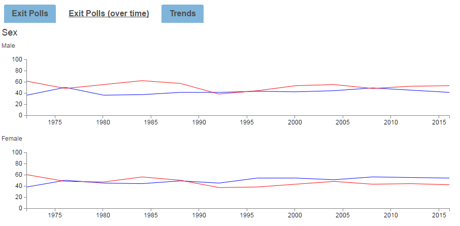

# USElectionTrends

Application to visualize the US elections data from 1972 to 2016 and is categorized into following sections

- Election Results: State wide results for the specific year.
- Exit Polls: The trends of vote percentage of different demographic groups over the time.
- Candidates Trends: Trends of presidential candidates before election of the specific state.

#### Click the image below to watch a short video demo.

The web application can be found at https://manorepo.github.io/USElectionTrends-Visual/.

### Data 

Application uses the data from the following sources

Election Results:  [American Presidency Project](http://www.presidency.ucsb.edu/elections.php) 

Exit Polls: New York Times and Edison Research

Trends: [Huffington Post Pollster API](http://elections.huffingtonpost.com/pollster/api)

### Functionality 

The application provides an intuitive user interface, which visualizes election results, exit polls, exit polls over time, and exit poll trends.

_**Election Results**_

When a particular year is selected the summary is updated on the top along with the map and exit polls data.
The summary shows the candidates participated and the total electoral votes they obtained.The color of the states in the map change accordingly. When the user hovers on each state it displays the total electoral votes of that state and the percentage of votes that candiates got in that state.

_**Exit Polls**_

_Specific Year:_
When the user selects the exit polls the data is represented in bar graphs according to votes percentage of different categories.

_Over Time:_
The user can view exit poll data as a time series, which allows users to identify trends in the voting choices of various demographics.

_**Trends**_

States which had the different result from the polls survey are highlighted as below

When the user selects the trends and any state on the map the trends before election of that particular state 
are showed using area graphs.

### Interesting Findings

#### Voter choices based on opinion on state of the nation and current president
From the exit poll time series data, it is evident that voter choices are dependent on opinions on the current state of the nation, and the party affiliation of the current president.  For example, in the 2004 election, in which the current president was a republican, those that believed the country was going in the right direction voted republican, while those that believed the country was going on the wrong track voted democrat.  Similarly, in the 2012 election, in which the current president was a democrat, those that believed the country was going in the right direction voted democrat, and those that believed the country was going on the wrong track voted republican.  This trend is also present in the "Condition of the nation's economy" category.

#### Team Responsibilities

Akhila Tummala(aktummal) - Data collection and Exit polls data for a specific year

James Taber(jmtaber129) - Web Structure, Results Summary and Exit poll over the time.

Manohar Kotapati(manorepo) - Huffington Pollster API, Presedential Candidate Trends before the election date.

Sunandha Perumalla(sunandha21) - Map and Election Results Visualization
